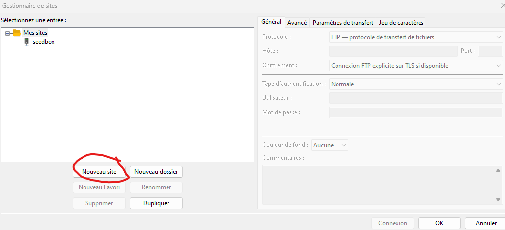
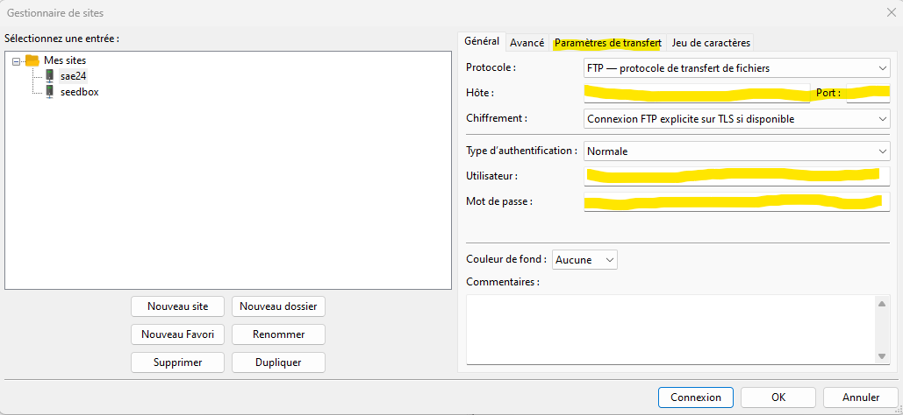
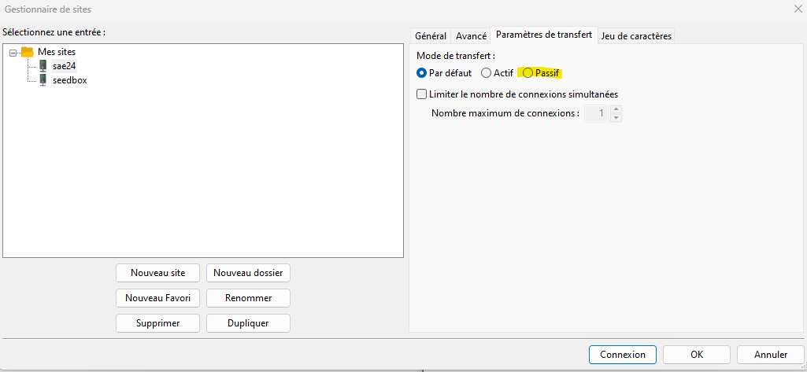

# Se connecter au serveur
Télécharger, installer et ouvrer fillezilla client. Une fois ouvert faite la combinaison de touche 

++ctrl+s++
## Ajouter un serveur
Cliquer sur ajouter un serveur 
<figure markdown>
  { width="800" }
  <figcaption>Ajouter un serveur</figcaption>
</figure>

## Remplir les champs

Remplisser les champs surligné
<figure markdown>
  { width="800" }
  <figcaption>identifiant de connexion</figcaption>
</figure>

## Activer le mode passif

Dans l'onglet Avancé cocher la case passif

<figure markdown>
  { width="800" }
  <figcaption>Mode passif</figcaption>
</figure>

