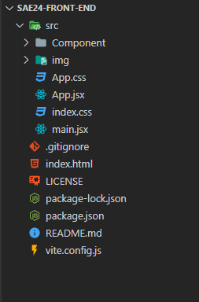

# Modifier un composant

## Structuration du projet 
L'arborésance du projet est structuré comme ceci


<figure markdown>
  { width="300" }
  <figcaption>Arborésance du projet</figcaption>
</figure>
Vous trouverez dans le dossier component les différents composant réact qui compose se projet  

## Composant React
La façon la plus simple de définir un composant est d'écrire une fonction JavaScript 

```js
function Welcome(props) {
  return <h1>Hello, {props.name}</h1>;
}
```
Un composant est une fonction Javascript qui retourne du HTML