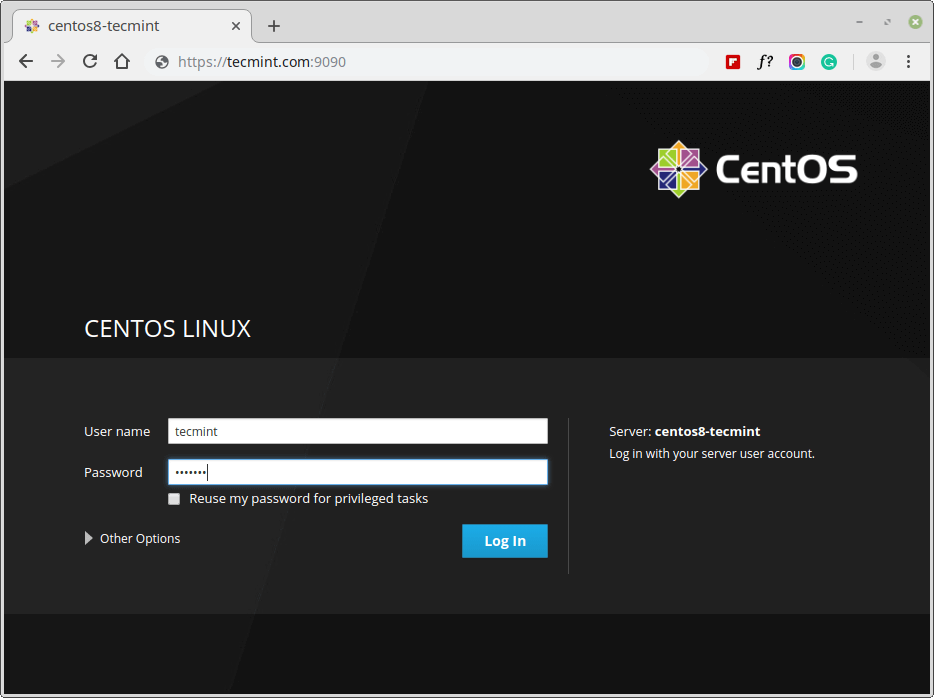

# CentOS

## Activation de Cockpit
Installer Cockpit pour CentOS

```bash linenums="1"
sudo yum install cockpit
```
Créer les régles de parfeu 

```bash linenums="1" title="Régle de parfeu"
sudo systemctl enable --now cockpit.socket
sudo firewall-cmd --permanent --zone=public --add-service=cockpit
sudo firewall-cmd --reload
```


  
## Accéder à Cockpit

Taper dans votre navigateur :

http://adresse_ip_de_la_machine/9090


<figure markdown>
  { width="800" }
  <figcaption>Page de connexion</figcaption>
</figure>

